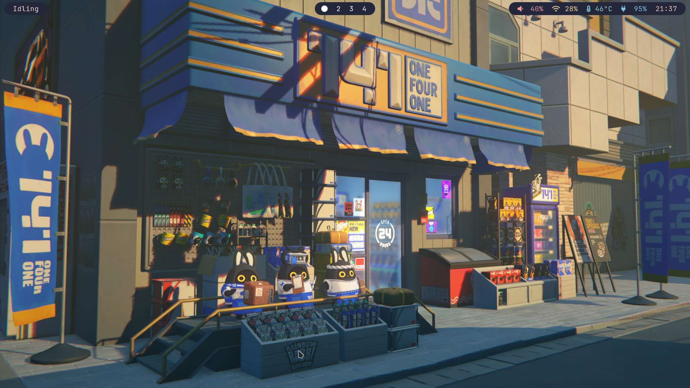
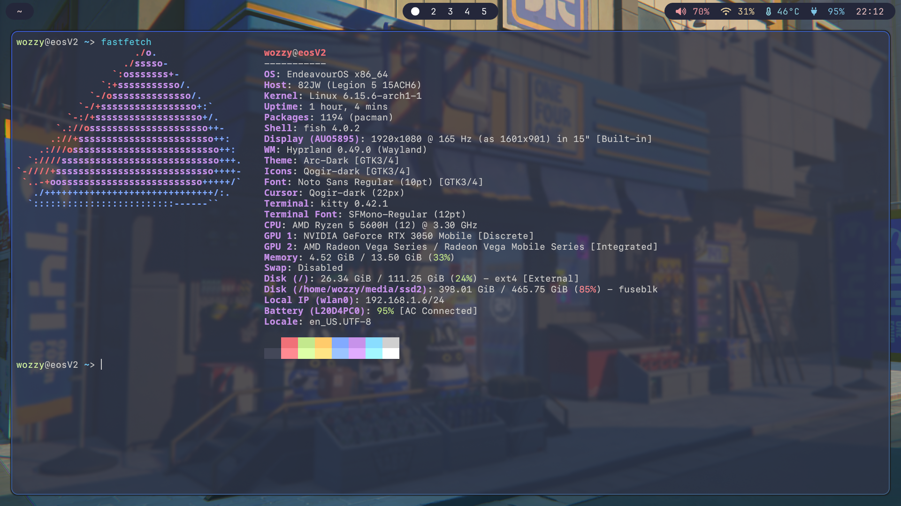
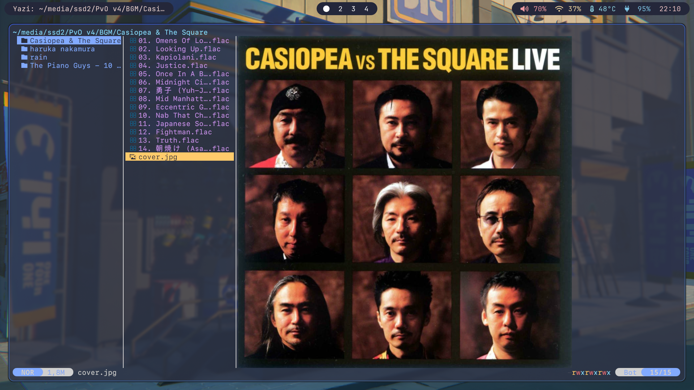
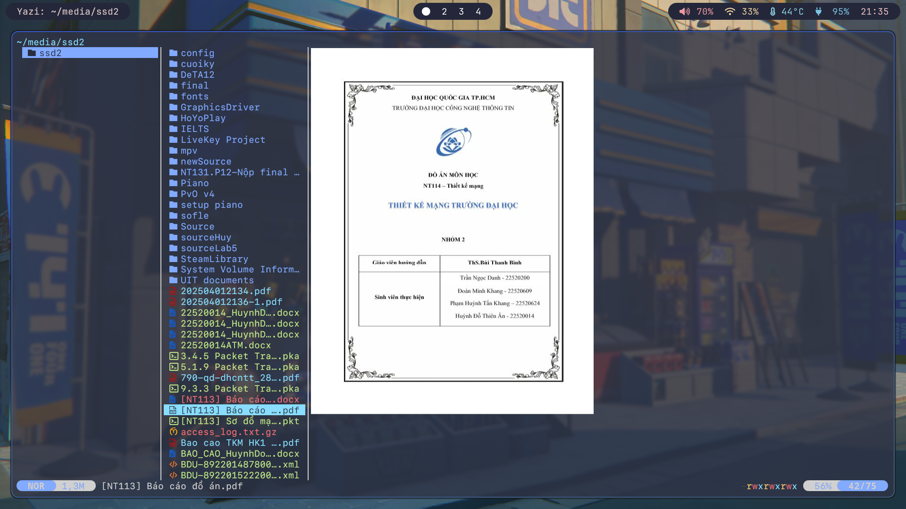
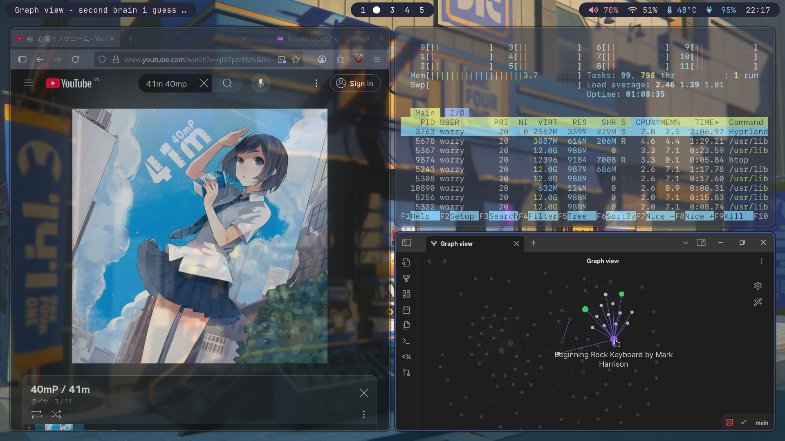
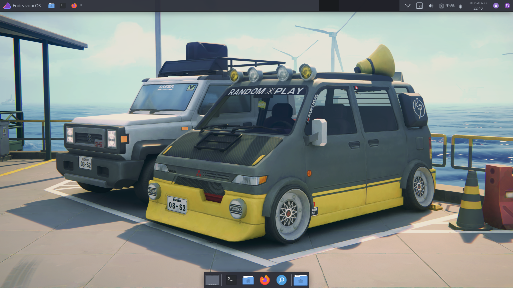

Dotfiles I'm currently using on my Linux machine, using **Hyprland**, **Kitty**, **Fish**, **Waybar**, and other lightweight tools. 
This setup is tuned for simplicity, with a bit of eye candy for a more pleasant experience.

I occasionally fall back to **XFCE** when something breaks in Hyprland or when certain apps don't behave correctly. 

## Screenshots
> These are some screenshots of the rice 

### Hyprland Desktop

### Waybar (on Hyprland)

### Kitty Terminal with Fish

### Yazi File Manager
Yazi file manager:
  

### Hyprland Layout Example
Tiling window layout using Hyprland:

### XFCE Desktop Environment
Overview of the simple XFCE DE setup:

